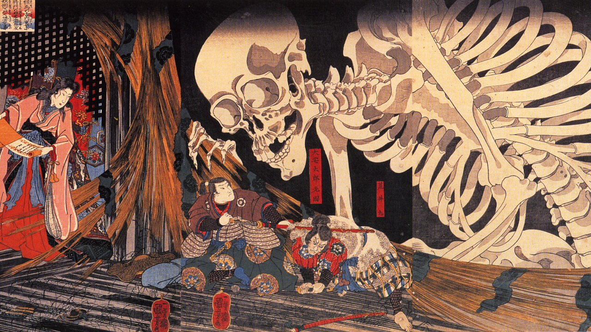

<!-- Optional banner goes here--> 

   
<!--socials-->

   
  
I'm <strong>Mateo Del Lungo</strong>, a Software Development student. I have a strong passion for programming so i'm constantly pushing myself to get better and expanding my knowledge.

  

  ### Toolset

  

    
    
    
    
   
    

  

  

    
    
   
    
   
  

  

    
    
    
  

   ### Projects
  
<em>Check out some of my projects.</em>

📚[Portfolio Bianca](https://biantattoo.pages.dev/)
> **Repository:** [portfolio-bianca](https://github.com/Mudo0/portfolio-bianca)

<em>Portfolio website for tattoo artist <strong>Bianca</strong>. Built with <strong>Angular</strong> and <strong>TypeScript</strong> using <strong>Signals</strong> and OnPush change detection, it features a gallery with lightbox and a contact form integrated with <strong>Google Apps Script</strong>, deployed on <strong>Cloudflare Pages</strong>.</em>

📚[Pokémon TCG](https://pokemon-tcg-g8-1.onrender.com)

<em>Digital version of the Pokémon Trading Card Game developed as a university project for <strong>UTN</strong>. Built with a <strong>Spring Boot</strong> backend in <strong>Java 21</strong> and an <strong>Angular</strong> frontend, it features a custom game engine that handles turns, attacks, damage calculation, special conditions and victory conditions. Real-time multiplayer synchronization is achieved through <strong>WebSocket</strong>, with <strong>PostgreSQL</strong> for persistence, <strong>Flyway</strong> for database migrations, and <strong>Docker Compose</strong> for containerized infrastructure.</em>

📚[Chat in real time](https://chat-collab-frontend.onrender.com) 
> **Repositories:** [Backend](https://github.com/Tomilomi/chat-in-realtime-collab) | [Frontend](https://github.com/Tomilomi/chat-collab-react)
  
<em>Collaborative Full-stack dynamic chat solution built with <strong>C#</strong> and <strong>ASP.NET Core</strong>. I implemented <strong>SignalR</strong> for high-performance, real-time bi-directional communication and integrated a secure <strong>Identity</strong> system for user authentication. The backend architecture follows the <strong>Result Pattern</strong> to ensure predictable error handling and clean business logic. Currently developing a responsive <strong>React</strong> frontend to provide a seamless messaging experience.</em>

  

📚El Estanciero 🎯(Current)

> **Repositories:** [Backend](https://github.com/Grupo-Prog/Proyecto-EstancieroWebApp-Backend) | [Frontend](https://github.com/Grupo-Prog/Proyecto-EstancieroWebApp-Frontend)

<em>Full-stack multiplayer strategy game developed in a collaborative environment. I architected the <strong>Java</strong> backend using <strong>Spring Boot</strong>, implementing <strong>WebSockets</strong> for real-time game state synchronization. On the frontend, I leveraged <strong>Angular</strong> with <strong>Tailwind CSS</strong> to create a responsive and dynamic user experience, ensuring seamless interaction between players.</em>

